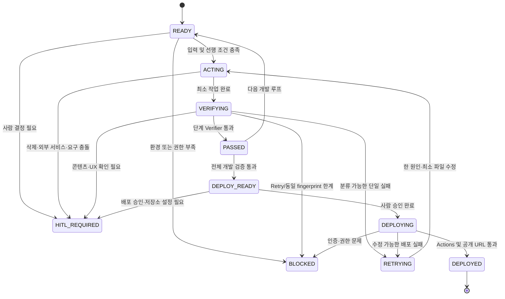

# 프로페셔널 웹사이트 AORR 상태 머신

## 0. 문서 목적과 실행 경계

이 문서는 `smiler07/smiler07.github.io`를 GitHub Pages에서 실행되는 정적 프로페셔널 웹사이트로 발전시키기 위한 AORR(Act → Observe → Reason → Repeat) 실행 명세다. 구현 에이전트는 아래 상태, 전이 조건, 검증 기준을 그대로 사용한다.

- 대상 저장소: `https://github.com/smiler07/smiler07.github.io`
- Git 원격 주소: `https://github.com/smiler07/smiler07.github.io.git`
- 배포 예상 URL: `https://smiler07.github.io/`
- 실행 형태: 백엔드 없는 HTML, CSS, JavaScript 정적 사이트
- 필수 루트 파일: `index.html`, `styles.css`, `script.js`
- 게임 코드: 공통 선택 로직은 `script.js`, 게임별 로직은 `games/snake.js`, `games/shooting.js` 등 별도 JavaScript 파일 권장
- 기본 최대 Retry: 단계별 3회
- 비밀정보: 토큰을 출력·저장·커밋하지 않는다.
- Step 1 이후 추가된 게임 요구사항: 사용자가 Games 영역에서 지렁이 게임과 슈팅 게임 중 하나를 선택해 플레이할 수 있어야 한다.
- `shooting_game/`에는 Python/Pygame 데스크톱 구현이 존재한다. GitHub Pages에서는 직접 실행할 수 없으므로 동작·규칙 참고 자료로만 보존하고 브라우저용 JavaScript/Canvas 구현을 별도로 개발한다.
- 개인 콘텐츠와 게임 세부 규칙 중 확정되지 않은 값은 임의로 작성하지 않고 `[사람 확인 필요]`로 유지한다.

## 1. 상태 정의와 전이

| 상태 | 의미 | 허용되는 다음 상태 |
|---|---|---|
| `READY` | 입력과 선행 조건이 준비됨 | `ACTING`, `BLOCKED`, `HITL_REQUIRED` |
| `ACTING` | 최소 범위의 파일 변경을 수행 중 | `VERIFYING`, `BLOCKED`, `HITL_REQUIRED` |
| `VERIFYING` | 해당 단계 Verifier와 회귀 검증을 수행 중 | `PASSED`, `RETRYING`, `BLOCKED`, `HITL_REQUIRED` |
| `RETRYING` | 단일 실패 원인을 최소 변경으로 수정할 준비가 됨 | `ACTING`, `BLOCKED`, `HITL_REQUIRED` |
| `PASSED` | 단계별 완료 기준을 충족함 | 다음 단계의 `READY`, 전체 완료 시 `DEPLOY_READY` |
| `DEPLOY_READY` | 모든 개발·검증 단계가 통과했고 배포 승인만 남음 | `DEPLOYING`, `HITL_REQUIRED`, `BLOCKED` |
| `DEPLOYING` | 승인된 커밋을 GitHub Pages에 배포 중 | `DEPLOYED`, `RETRYING`, `BLOCKED`, `HITL_REQUIRED` |
| `DEPLOYED` | Actions와 실제 공개 URL 검증이 완료됨 | 종료 |
| `BLOCKED` | 환경·권한·재시도 한계로 자동 진행 불가 | 사람 조치 후 해당 단계의 `READY` |
| `HITL_REQUIRED` | 사람의 콘텐츠·정책·UX·배포 결정이 필요함 | 승인·입력 후 해당 단계의 `READY`, 거절 시 `BLOCKED` |



## 2. Target

### 2.1 프로페셔널 웹사이트 목표

- 방문자가 소유자의 전문 분야, 경력, 기술, 대표 프로젝트, 연락 방법을 빠르게 이해할 수 있어야 한다.
- 콘텐츠는 시맨틱 HTML로 구성하며 JavaScript가 비활성화되어도 핵심 프로필을 읽을 수 있어야 한다.
- 이름, 직함, 소개, 경력, 프로젝트, 연락처, 프로필 링크의 실제 값은 `[사람 확인 필요]`다.
- 디자인 톤, 대표 색상, 프로필 이미지, 이력서 다운로드 제공 여부는 `[사람 확인 필요]`다.

### 2.2 GitHub Pages 배포 목표

- `main` 브랜치의 승인된 정적 파일을 GitHub Pages 사용자 사이트로 배포한다.
- 사이트는 `https://smiler07.github.io/`의 루트 경로 `/`에서 정상 동작해야 한다.
- 루트 경로가 허용되는 사용자 사이트지만 이식성을 위해 상대 경로(`./styles.css`)를 기본으로 사용한다.
- 최종 URL이 HTTP 200을 반환하고 주요 정적 자원이 정상 로드되어야 한다.
- 저장소 Pages Source를 `GitHub Actions`로 변경하는 작업은 `HITL_REQUIRED`다.

### 2.3 입력 자료

| 입력 | 상태 |
|---|---|
| 기존 `README.md` | 저장소에서 확인 가능 |
| `index.html`, Pages 설정 또는 workflow | 새 저장소에는 아직 없음; 구현·배포 루프에서 생성 또는 설정 |
| 이름, 영문/한글 표기 | `[사람 확인 필요]` |
| 직함과 한 줄 소개 | `[사람 확인 필요]` |
| 상세 소개 및 경력 | `[사람 확인 필요]` |
| 기술 스택 | `[사람 확인 필요]` |
| 프로젝트명, 설명, 링크, 이미지 | `[사람 확인 필요]` |
| 이메일·GitHub·LinkedIn 등 연락 링크 | `[사람 확인 필요]` |
| 프로필 이미지와 대체 텍스트 | `[사람 확인 필요]` |
| 디자인 레퍼런스와 브랜드 색상 | `[사람 확인 필요]` |
| 게임 세부 규칙과 난이도 | 기본안 사용 가능, 변경 시 `[사람 확인 필요]` |
| `shooting_game/` Python/Pygame 구현과 기존 pytest | 브라우저 포팅의 동작 참고 자료; GitHub Pages 런타임에는 포함하지 않음 |
| 슈팅 게임 Web MVP 범위 | `[사람 확인 필요]` — 최소 1기체·1스테이지 또는 기존 6기체·다중 스테이지 중 선택 |

### 2.4 필수 페이지와 섹션

정적 단일 페이지를 기본안으로 한다. Games는 상단 탭을 통해 같은 문서의 게임 선택 영역으로 이동한다. 사용자는 지렁이 게임 또는 슈팅 게임 카드를 선택할 수 있어야 하며, 한 번에 하나의 게임만 활성화한다. 별도 `games.html` 페이지가 필요한지는 `[사람 확인 필요]`다.

- 공통 Header와 반응형 Navigation
- Home/Hero
- About
- Experience 또는 Career
- Skills
- Projects
- Contact
- Games
- Footer

### 2.5 Games 탭, 게임 선택기와 게임별 요구사항

- 상단 Navigation에 `Games` 탭이 존재한다.
- 클릭 또는 키보드 활성화로 Games 영역에 도달한다.
- Games 영역에서 `Snake`와 `Shooting`을 명확하게 선택할 수 있다.
- 게임은 별도 서버, Python 런타임, 외부 게임 엔진 없이 HTML5 Canvas/DOM과 JavaScript로 실행된다.
- 게임 전환 시 이전 게임의 timer, animation frame, keyboard/touch listener를 정리한다.
- 같은 게임을 다시 열어도 게임 loop와 event listener가 중복되지 않는다.

#### 지렁이 게임

- 기본 규칙: 격자 이동, 먹이 생성, 먹이 획득 시 성장·점수 증가, 벽 또는 자기 몸 충돌 시 종료.
- 180도 즉시 역방향 전환을 차단한다.
- 시작, 일시정지, 재시작, 현재 점수, 게임 종료 상태를 제공한다.
- 키보드: 방향키 및 WASD 지원.
- 모바일: 충분한 크기의 화면 방향 버튼을 필수로 지원.
- 스와이프 조작 추가 여부는 `[사람 확인 필요]`다.
- 벽 통과, 최고 점수 저장, 난이도·속도 증가 규칙은 `[사람 확인 필요]`다.
- 게임 상태 로직과 DOM/Canvas 렌더링을 분리해 검증 가능하게 한다.

#### 슈팅 게임

- `shooting_game/`의 Pygame 구현을 참고해 세로 스크롤 슈팅의 핵심 동작을 JavaScript로 포팅한다.
- Web MVP 필수: 플레이어 이동, 일반 사격, 적 생성, 적/탄환 이동, 충돌, 점수, 생명, 일시정지, 게임오버, 재시작.
- 키보드: 방향키/WASD 이동, Z 또는 Space 사격, P 또는 Escape 일시정지.
- 모바일: 방향 또는 가상 스틱 입력과 별도의 사격 버튼을 제공한다.
- Canvas 크기는 viewport를 넘지 않고 논리 해상도와 표시 크기를 분리한다.
- 원본 Python의 6기체, 차지 샷, 포메이션, 폭탄, 파워업, 다중 스테이지를 전부 포팅할지는 `[사람 확인 필요]`다.
- 기존 Python 테스트는 규칙 참고용이며 JavaScript 테스트 통과를 대신하지 않는다.

### 2.6 완료 기준

#### 데스크톱

- 1280×720 및 1440×900 viewport에서 콘텐츠가 겹치거나 잘리지 않는다.
- 상단 Navigation의 모든 링크가 작동하고 현재 영역을 식별할 수 있다.
- 키보드만으로 Navigation, Games, 시작·일시정지·재시작을 조작할 수 있다.
- 방향키와 WASD로 지렁이를 조작할 수 있다.
- 게임 선택기에서 Snake와 Shooting을 전환할 수 있다.
- 슈팅 게임에서 이동·사격·일시정지·재시작을 키보드로 조작할 수 있다.
- 콘솔에 처리되지 않은 오류가 없다.

#### 모바일

- 320×568, 375×667, 390×844, 768×1024 viewport에서 가로 스크롤이 없다.
- 메뉴, 버튼, 링크의 터치 대상은 가능한 한 최소 44×44 CSS px를 확보한다.
- 게임 보드가 viewport 폭을 넘지 않는다.
- 터치 방향 버튼이 오입력을 최소화하고 게임 중 페이지 스크롤과 충돌하지 않는다.
- 슈팅 게임의 모바일 이동·사격 버튼을 한 손 또는 두 엄지로 사용할 수 있다.
- 화면 회전 또는 resize 후에도 게임 UI가 사용할 수 있는 상태를 유지한다.

## 3. Act

### 3.1 한 번의 개발 루프에서 수행할 최소 작업

1. `READY` 단계 하나를 선택한다.
2. 해당 단계의 단일 완료 기준을 깨는 가장 작은 작업만 수행한다.
3. 파일 변경은 원칙적으로 1~3개로 제한한다.
4. 변경 후 즉시 `VERIFYING`으로 전환하고 그 단계의 동일한 Verifier를 실행한다.
5. 성공하면 `PASSED`, 실패하면 한 개의 Reason code와 fingerprint를 기록한다.

### 3.2 수정 가능한 파일 범위

- `index.html`
- `styles.css`
- `script.js`
- 게임 선택 및 공통 lifecycle 코드: `script.js` 또는 `games/game-selector.js`
- 지렁이 게임: `games/snake.js`
- 슈팅 게임 Web 포트: `games/shooting.js`
- Python/Pygame 참고 구현: `shooting_game/src/**`, `shooting_game/tests/**` — 별도 승인 없이 기능 삭제·대규모 수정 금지
- 로컬 정적 자원: `assets/**`
- 테스트·검증 도구: `tests/**`, `verify.mjs`
- 문서: `README.md`, `AORR.md`
- 배포 단계에서만 `.github/workflows/pages.yml`

다음은 사전 사람 확인 없이는 수정하지 않는다.

- 기존 개인 콘텐츠 삭제
- 저장소 설정 및 GitHub Pages Source
- 외부 분석·광고·폼·CDN 서비스
- 라이선스와 보안 정책
- Git 기록 재작성

### 3.3 생성 가능한 파일

- 필수: `styles.css`, `script.js`
- 선택: `games/game-selector.js`, `games/snake.js`, `games/shooting.js`, `assets/images/*`, `assets/icons/*`, `assets/games/*`
- 검증: `verify.mjs`, `tests/game.test.mjs`
- 외부 패키지 없이 실행 가능한 파일을 우선한다.

### 3.4 실행 가능한 로컬 검증 명령

아래 명령은 구현 단계에서 저장소 루트에서 실행한다. 이 설계 단계에서는 실행하지 않는다.

```powershell
# 필수 파일
Get-Item .\index.html, .\styles.css, .\script.js

# JavaScript 문법
node --check .\script.js
if (Test-Path .\snake.js) { node --check .\snake.js }
if (Test-Path .\games\snake.js) { node --check .\games\snake.js }
if (Test-Path .\games\shooting.js) { node --check .\games\shooting.js }

# Node 내장 테스트 러너(테스트 파일 생성 후)
node --test .\tests\*.test.mjs

# 정적 서버
python -m http.server 4173

# 별도 PowerShell에서 HTTP 응답 확인
(Invoke-WebRequest http://127.0.0.1:4173/).StatusCode
(Invoke-WebRequest http://127.0.0.1:4173/styles.css).StatusCode
(Invoke-WebRequest http://127.0.0.1:4173/script.js).StatusCode

# GitHub Pages 사용자 사이트 루트를 모사하는 로컬 검사
# http://127.0.0.1:4173/ 로 접근한다.
```

브라우저 Verifier는 데스크톱과 모바일 viewport에서 페이지를 열어 콘솔 오류, 네트워크 404, 레이아웃, 키보드·터치 조작을 확인한다.

## 4. Observe

각 `VERIFYING` 단계는 다음 관측값을 구조화해서 남긴다.

```text
step: <단계 ID>
attempt: <1..3>
state: VERIFYING
files_expected: [...]
files_found: [...]
commands: [{command, exit_code, summary}]
http: [{url, status}]
console_errors: [...]
viewport_results: [{width, height, overflow, notes}]
game_controls: {keyboard, wasd, touch, reverse_blocked}
pages_compatibility: {relative_assets, workflow, result}
reason_code: <Reason 또는 null>
fingerprint: <정규화된 오류 식별자 또는 null>
```

필수 관측 대상:

- 루트 필수 파일 생성 여부
- HTML 문서 구조, 링크 대상, 중복 ID, 누락된 대체 텍스트
- CSS 파싱 문제, overflow, 겹침, breakpoint 동작
- JavaScript 문법·런타임 오류
- 로컬 서버의 HTML/CSS/JS HTTP 응답
- 브라우저 콘솔 오류와 네트워크 404
- 데스크톱 및 모바일 viewport 결과
- 게임 선택, 게임 간 전환, 키보드, WASD, 모바일 터치 조작
- 지렁이와 슈팅 게임별 lifecycle, 점수, 충돌, 재시작
- 상대 경로와 GitHub Pages workflow 호환성

## 5. Reason 분류 기준

Reason은 한 번에 정확히 하나만 선택한다. 여러 문제가 있으면 사용자 영향과 선행 관계가 가장 큰 원인을 먼저 선택하고 나머지는 후속 관측으로 남긴다.

| Reason | 분류 기준 | 대표 fingerprint |
|---|---|---|
| `HTML_STRUCTURE` | 필수 요소 누락, 잘못된 중첩, 중복 ID, 링크 대상 없음 | `HTML:<selector>:<rule>` |
| `CSS_RESPONSIVE` | overflow, 겹침, 읽기 어려운 크기, breakpoint·터치 대상 실패 | `CSS:<viewport>:<selector>:<rule>` |
| `JAVASCRIPT` | 문법 오류, 처리되지 않은 예외, DOM 참조·초기화 실패 | `JS:<error-name>:<file>:<line>` |
| `GAME_LOGIC` | 이동, 성장, 먹이, 충돌, 점수, 상태 전이가 규칙과 다름 | `GAME_LOGIC:<test-name>:<expected>/<actual>` |
| `GAME_CONTROL` | 키보드·WASD·터치가 누락되거나 중복 입력·스크롤 충돌 발생 | `CONTROL:<device>:<action>:<result>` |
| `CONTENT` | 개인 정보가 비어 있거나 모호하고 임의 작성이 필요한 상태 | `CONTENT:<section>:MISSING_OR_UNCONFIRMED` |
| `TEST` | Verifier 자체 오류, 불안정 테스트, 잘못된 fixture·assertion | `TEST:<verifier>:<error>` |
| `ENVIRONMENT` | Node/Python/브라우저 부재, 포트 충돌, 로컬 권한 문제 | `ENV:<tool-or-port>:<error>` |
| `GITHUB_PERMISSION` | 인증 실패, push·Pages·Actions 권한 부족 | `GH_PERMISSION:<operation>:<http-or-git-code>` |
| `DEPLOYMENT` | Actions 실패, artifact·환경·URL 배포 실패 | `DEPLOY:<run>:<step>:<conclusion>` |
| `UNKNOWN` | 관측 정보로 위 범주를 신뢰성 있게 선택할 수 없음 | `UNKNOWN:<stable-message-hash>` |

`CONTENT`, `GITHUB_PERMISSION`, 요구 충돌을 포함한 `UNKNOWN`은 자동 수정하지 않고 원칙적으로 `HITL_REQUIRED` 또는 `BLOCKED`로 전환한다.

## 6. Repeat

1. 실패 관측에서 Reason code 하나와 fingerprint 하나를 선택한다.
2. 그 원인과 직접 관련된 최소 파일만 변경한다.
3. 새로운 기능이나 리팩터링을 같은 retry에 섞지 않는다.
4. 실패한 동일 Verifier를 같은 입력으로 다시 실행한다.
5. 동일 Verifier가 통과하면 해당 단계 이전에 통과한 핵심 회귀 테스트를 실행한다.
6. 새로운 실패가 나오면 별도 Reason과 fingerprint로 다음 retry를 시작한다.
7. retry마다 `attempt`, 변경 파일, 관측 결과를 기록한다.

최소 회귀 세트:

- 필수 파일 존재
- `node --check` 전체 JavaScript 통과
- 게임 로직 단위 테스트 통과
- `/`, `styles.css`, `script.js` HTTP 200
- 375px 및 1440px 가로 overflow 없음
- Navigation 및 Games 선택 영역 진입 가능
- Snake와 Shooting 선택·전환 가능하며 활성 loop가 게임별 1개 이하
- 두 게임의 키보드와 모바일 터치 기본 조작 가능

## 7. Stop

다음 중 하나면 현재 실행을 멈춘다.

- 모든 개발 단계와 전체 회귀 테스트 통과: `DEPLOY_READY`
- 배포 및 공개 URL 검증까지 통과: `DEPLOYED`
- 단계별 최대 Retry 3회 도달: `BLOCKED`
- 정규화된 동일 오류 fingerprint가 연속 2회 반복: `BLOCKED`
- 이름, 소개, 경력, 프로젝트, 연락처 등 개인 콘텐츠 확인 필요: `HITL_REQUIRED`
- 기존 콘텐츠 삭제 또는 공개 범위 변경 필요: `HITL_REQUIRED`
- GitHub 인증, push, Actions, Pages 설정 권한 문제: `BLOCKED` 또는 `HITL_REQUIRED`
- 요구사항 충돌, 외부 서비스 도입, 민감정보 노출 가능성: `HITL_REQUIRED`

## 8. Human-in-the-loop

| 조건 | 상태 | 사람에게 요청할 결정 |
|---|---|---|
| 이름·소개·경력·프로젝트가 불명확함 | `HITL_REQUIRED` | 실제 공개 문구와 링크 제공·승인 |
| 이메일·사진 등 개인정보 공개 | `HITL_REQUIRED` | 공개 범위와 대체 연락 방식 승인 |
| 기존 콘텐츠 삭제·대체 필요 | `HITL_REQUIRED` | 삭제 대상과 복구 가능성 승인 |
| Analytics, 외부 폼, CDN 등 추가 | `HITL_REQUIRED` | 서비스, 개인정보, 비용, CSP 영향 승인 |
| GitHub Pages Source·도메인·환경 설정 변경 | `HITL_REQUIRED` | 저장소 관리자 설정 변경 승인 |
| push 또는 공개 배포 | `HITL_REQUIRED` | 커밋 diff와 검증 결과 확인 후 승인 |
| 단일 페이지와 별도 Games 페이지 요구 충돌 | `HITL_REQUIRED` | 정보구조 선택 |
| 슈팅 게임 Web MVP 범위가 불명확함 | `HITL_REQUIRED` | 최소 MVP 또는 Python 기능 전체 포팅 범위 선택 |
| Pygame 코드·에셋을 웹용으로 변경 또는 삭제해야 함 | `HITL_REQUIRED` | 원본 보존 방식과 포팅 범위 승인 |
| 터치 버튼과 스와이프 요구가 불명확함 | `HITL_REQUIRED` | 필수 모바일 조작 방식 선택 |
| 디자인·접근성·게임성 요구 충돌 | `HITL_REQUIRED` | 우선순위와 수용 가능한 타협 결정 |

## 9. 단계별 실행 루프

모든 단계는 `READY → ACTING → VERIFYING`을 기본 경로로 사용한다. 테스트 실패 시 `RETRYING`, 성공 시 `PASSED`, 사람 결정이 필요하면 `HITL_REQUIRED`, 자동 진행이 불가능하면 `BLOCKED`로 전환한다.

| ID / 개발 루프 | 입력 | Act | Observe | 출력 | 테스트·완료 기준 | 성공 시 다음 상태 | 실패·불명확 시 다음 상태 |
|---|---|---|---|---|---|---|---|
| L01 저장소 및 기존 파일 확인 | 저장소 URL, 현재 branch·파일·workflow | 읽기 전용으로 구조, 상태, 기존 콘텐츠와 Pages workflow를 조사 | branch, dirty files, 필수 파일, 기존 콘텐츠, workflow | 기준선 보고와 보존 대상 목록 | 저장소 접근 가능, 변경 전 상태 기록, 비밀 파일 미추적 확인 | `PASSED` → L02 `READY` | 환경 문제 `BLOCKED`; 삭제·충돌 `HITL_REQUIRED` |
| L02 정적 사이트 기본 구조 | L01 기준선, 필수 파일 목록 | `index.html`, `styles.css`, `script.js` 연결과 시맨틱 shell 구성 | 파일 존재, CSS/JS HTTP 상태, 콘솔 초기화 오류 | 실행 가능한 정적 shell | 필수 파일 존재, 상대 경로 로드, HTTP 200, JS 문법 통과 | `PASSED` → L03 `READY` | `HTML_STRUCTURE`/`JAVASCRIPT` → `RETRYING` |
| L03 프로페셔널 콘텐츠 영역 | 승인된 이름·소개·경력·기술·프로젝트·연락처 | Hero, About, Experience, Skills, Projects, Contact, Footer 작성 | 누락 섹션, 링크, heading 순서, 임의 콘텐츠 여부 | 읽을 수 있는 포트폴리오 본문 | 모든 승인 콘텐츠 표시, 링크 유효, heading 계층 정상 | `PASSED` → L04 `READY` | 콘텐츠 미확정 `HITL_REQUIRED`; 구조 오류 `RETRYING` |
| L04 반응형 내비게이션 | 섹션 ID, Games 위치, 모바일 메뉴 정책 | Home·About·Experience·Projects·Games·Contact 링크와 모바일 메뉴 구현 | 키보드 포커스, 활성화, 320px overflow, 메뉴 닫힘 | 접근 가능한 반응형 Header/Nav | 모든 링크 정상, 키보드 접근, 모바일 메뉴 작동, 가로 overflow 없음 | `PASSED` → L05 `READY` | `CSS_RESPONSIVE`/`JAVASCRIPT` → `RETRYING` |
| L05 Games 선택 허브 | L04 Nav, 단일/별도 Games 페이지 결정 | Snake·Shooting 선택 카드, 공통 game stage와 상태 안내 구성 | 링크, focus, 선택 상태, 빈 상태 | 접근 가능한 게임 선택 진입점 | 클릭·Enter로 두 게임 선택 가능, 한 번에 한 game panel만 활성 | `PASSED` → L06S `READY` | 정보구조 불명확 `HITL_REQUIRED`; 구조 오류 `RETRYING` |
| L06S 지렁이 핵심 로직 | 보드 크기, 초기 지렁이, 먹이·충돌·점수 규칙 | 순수 상태 함수로 이동, 성장, 먹이, 벽·자기 충돌 구현 | deterministic test와 상태 snapshot | UI와 분리된 Snake 엔진 | 이동·성장·먹이·충돌·역방향 차단 테스트 통과 | `PASSED` → L07S `READY` | `GAME_LOGIC` → `RETRYING`; 규칙 불명확 `HITL_REQUIRED` |
| L07S 지렁이 조작·UI | L06S API, 키·터치 매핑 | 키보드, 터치, 보드, 점수, pause, restart 연결 | 입력별 방향, 스크롤 충돌, 상태별 UI | 완전한 Snake 플레이 흐름 | 키보드·터치와 시작→점수→종료→재시작 통과 | `PASSED` → L08H `READY` | `GAME_CONTROL`/`JAVASCRIPT` → `RETRYING` |
| L08H 슈팅 원본 감사·Web 범위 | `shooting_game/src`, tests, README, 계획서 | Pygame 상태·입력·규칙을 Web MVP 계약으로 매핑하고 포팅 범위 확정 | 기능 matrix, 제외 기능, 원본 보존 상태 | 승인 가능한 Web 포팅 명세 | Python 의존성·MVP·입력·완료 기준 명시 | `PASSED` → L09H `READY` | 범위 불명확 `HITL_REQUIRED`; 원본 문제 `BLOCKED` |
| L09H 슈팅 핵심 JavaScript 로직 | 승인된 Web MVP, Pygame 동작 참고 | 플레이어·탄환·적·충돌·점수·생명 상태를 순수 로직으로 구현 | deterministic unit test와 상태 snapshot | UI와 분리된 Shooting 엔진 | 이동·사격·spawn·충돌·점수·game over 테스트 통과 | `PASSED` → L10H `READY` | `GAME_LOGIC` → `RETRYING` |
| L10H 슈팅 조작·Canvas UI | L09H API, 입력·viewport 기준 | Canvas 렌더링, 키보드, 모바일 이동·사격, pause·restart 연결 | frame, 입력, hitbox, resize, 중복 loop | Web Shooting MVP | 데스크톱·모바일에서 시작→사격→점수→종료→재시작 통과 | `PASSED` → L11G `READY` | `GAME_CONTROL`/`CSS_RESPONSIVE`/`JAVASCRIPT` → `RETRYING` |
| L11G 게임 전환 lifecycle | 두 게임 controller와 선택 허브 | activate/deactivate/destroy 계약으로 전환·cleanup 구현 | listener, timer, RAF 수와 재진입 결과 | 안전한 게임 전환 | 반복 전환 후 활성 게임만 동작, loop·listener 중복 없음 | `PASSED` → L12 `READY` | `GAME_CONTROL`/`JAVASCRIPT` → `RETRYING` |
| L12 접근성과 반응형 검증 | 사이트와 두 게임, viewport matrix | landmark, label, focus, contrast, reduced-motion, viewport 검증 | 콘솔, focus, 320/375/390/768/1280/1440 화면 | 접근성·반응형 검증 보고 | 핵심 접근성 오류 0, overflow 0, 두 게임 키보드·터치 접근 | `PASSED` → L13 `READY` | `HTML_STRUCTURE`/`CSS_RESPONSIVE`/`TEST` → `RETRYING` |
| L13 GitHub Pages 호환성 검증 | 정적 파일, Pages 배포 방식, 사이트 루트 | 상대 경로, 대소문자, Python 런타임 비의존, 배포 설정 검토 | 로컬 루트 HTTP, 404, 배포 대상 파일 | 배포 후보와 호환성 보고 | 두 게임이 순수 정적 자원으로 동작, 비밀·venv·pycache 제외 | `PASSED` → `DEPLOY_READY` | 수정 가능 `RETRYING`; 설정·권한 `HITL_REQUIRED`/`BLOCKED` |
| L14 배포 | `DEPLOY_READY`, 전체 테스트, 사람 승인, GitHub 권한 | 승인된 변경만 commit/push하고 승인된 Pages 배포 방식 실행 | commit SHA, Pages build, 공개 URL과 두 게임 | GitHub Pages 공개 사이트 | 배포 성공, 공개 URL 200, 두 게임 데스크톱·모바일 smoke 통과 | `DEPLOYED` | 권한 `BLOCKED`; 설정 변경 `HITL_REQUIRED`; 배포 오류 `RETRYING` |

## 10. 단계 공통 Verifier 계약

각 단계는 아래 형식의 결과를 반환해야 다음 상태로 전이할 수 있다.

```json
{
  "step": "L06",
  "attempt": 1,
  "state": "VERIFYING",
  "passed": false,
  "reason": "GAME_LOGIC",
  "fingerprint": "GAME_LOGIC:self-collision:expected-gameover/actual-playing",
  "changed_files": ["script.js", "tests/game.test.mjs"],
  "verifiers": [
    {"name": "node-check", "exit_code": 0},
    {"name": "game-tests", "exit_code": 1}
  ],
  "next_state": "RETRYING"
}
```

`PASSED` 결과는 `reason`과 `fingerprint`가 `null`이어야 하며, `changed_files`가 단계에서 허용한 범위를 벗어나면 통과로 인정하지 않는다.

## 11. 권장 최초 실행 루프

최초 실행은 L01로 한다.

- 시작 상태: `READY`
- Act: 저장소와 기존 파일을 읽기 전용으로 확인
- 변경 파일: 없음
- 위험도: 낮음
- Stop condition: 현재 branch, dirty state, 기존 콘텐츠, 필수 파일, Pages workflow, 보존 대상을 모두 기록
- 다음 상태: 통과 시 L02 `READY`
- 사람 확인: 기존 콘텐츠 삭제 또는 충돌이 발견될 때만 `HITL_REQUIRED`

L02 이후 실제 개인 콘텐츠가 없으면 L03에서 임의 문구를 만들지 않고 `CONTENT`로 분류해 `HITL_REQUIRED`로 멈춘다.

## Self-Correcting TDD Loop

### 12.1 설계 시점의 실제 기준선

이 절은 설계 시점에 읽기 전용으로 확인한 저장소와 실행 환경을 기준으로 한다. 이 확인 과정에서는 웹사이트 테스트, 로컬 서버, 브라우저 검증을 실행하지 않았다.

#### 현재 저장소 파일

| 경로 | 상태 | 의미 |
|---|---|---|
| `index.html` | 없음 | 구현 루프에서 생성 필요 |
| `README.md` | 존재 | 새 저장소의 초기 문서 |
| `AORR.md` | 존재, 아직 Git 미추적 | AORR 실행 명세 |
| `MEMORY.md` | 존재, 아직 Git 미추적 | 상태와 가드레일 기록 |
| `.nojekyll` | 없음 | 선택한 배포 방식에 따라 생성 검토 |
| `.github/workflows/pages.yml` | 없음 | GitHub Actions 방식을 선택한 경우 생성 필요 |
| `styles.css` | 없음 | 구현 루프에서 생성 필요 |
| `script.js` | 없음 | 구현 루프에서 생성 필요 |
| `package.json` 및 lockfile | 없음 | npm 기반 명령을 사용하면 안 됨 |
| 테스트 파일과 테스트 설정 | 없음 | 현재 실행 가능한 프로젝트 테스트 명령 없음 |
| `shooting_game/src/**` | Python 파일 27개 존재 | Pygame 데스크톱 원본; Web 포팅 참고 자료 |
| `shooting_game/tests/test_game_logic.py` | pytest 10개 존재 | Python 원본 회귀 참고; JavaScript 테스트를 대체하지 않음 |
| `shooting_game/venv`, `.pytest_cache`, `__pycache__`, `*.pyc` | 로컬 생성물 존재 | Git·Pages artifact에서 반드시 제외 |

#### 실제 실행 도구

| 도구 | 확인 결과 | 실행 정책 |
|---|---|---|
| Node.js | 번들 `v24.14.0` 사용 가능 | 일반 PATH가 아니라 아래 명시적 경로 사용 |
| Python | 번들 `3.12.13` 사용 가능 | 일반 PATH의 Store alias 대신 아래 명시적 경로 사용 |
| Git | `2.55.0.windows.2` 사용 가능 | 명시적 경로 사용 |
| Claude Code | `2.1.197` 설치됨 | 명시적 경로 사용 가능 |
| Claude 인증 | `loggedIn: false`, `authMethod: none` | 현재 독립 Verifier로 실행 금지 |
| Sonnet 5 | 계정 미인증으로 실제 사용 가능 여부 확인 불가 | 사용 가능하다고 가정하지 않음 |
| npm / npx | 일반 PATH에서 없음, 프로젝트 manifest도 없음 | npm/npx 명령을 Verifier에 포함하지 않음 |
| 브라우저 자동화 | Codex Browser 기능은 세션에 제공되지만 실제 페이지 검증은 아직 미실행 | 실행 성공 전까지 조건부 Verifier로 취급 |

```powershell
$Node = 'C:\Users\yunhy\.cache\codex-runtimes\codex-primary-runtime\dependencies\node\bin\node.exe'
$Python = 'C:\Users\yunhy\.cache\codex-runtimes\codex-primary-runtime\dependencies\python\python.exe'
$Git = 'C:\Program Files\Git\cmd\git.exe'
$Claude = 'C:\Users\yunhy\.local\bin\claude.exe'
```

존재하지 않는 `npm test`, `npm run lint`, `npx playwright test` 또는 임의의 프레임워크 명령은 실행하지 않는다. 향후 테스트 파일이 실제로 생성된 뒤에만 Node 내장 테스트 러너를 활성화한다.

### 12.2 Verifier 중심 TDD 상태 전이

각 기능은 하나의 관측 가능한 실패부터 시작한다. Verifier 없이 구현 코드를 먼저 추가하지 않는다.

```text
READY
  -> RED: 실패해야 하는 Verifier 하나를 정의
  -> VERIFYING_RED: 예상한 reason/fingerprint로 실패하는지 확인
  -> ACTING_GREEN: 그 실패만 해결하는 최소 구현
  -> VERIFYING_GREEN: 동일 Verifier 재실행
  -> REGRESSION: 이전에 통과한 Verifier 재실행
  -> PASSED: 모든 관련 검증 통과
  -> 다음 READY
```

다음 경우에는 상태를 바꾼다.

- RED 단계가 예상과 달리 통과: 요구사항 또는 Verifier 오류이므로 `TEST` → `RETRYING`
- RED 단계가 다른 원인으로 실패: 먼저 환경·fixture를 수정하고 기능 코드는 수정하지 않음
- GREEN 실패: 단일 Reason으로 분류해 `RETRYING`
- 회귀 실패: 새 기능은 `PASSED`로 인정하지 않고 회귀 fingerprint를 우선 수정
- 환경·권한 실패: `ENVIRONMENT` 또는 `GITHUB_PERMISSION`으로 분류하고 코드 변경 없이 `BLOCKED`

### 12.3 Verifier 계층과 실행 순서

| 순서 | Verifier | 담당 범위 | 현재 실행 가능성 | 실패 Reason |
|---|---|---|---|---|
| V00 | Repository inventory | 필수 파일, 추적 상태, 금지 파일 | PowerShell/Git로 가능 | `HTML_STRUCTURE`, `ENVIRONMENT` |
| V01 | Static reference verifier | CSS/JS 연결, 로컬 경로, 대소문자, 내부 링크 | `verify.mjs` 생성 후 번들 Node로 가능 | `HTML_STRUCTURE` |
| V02 | HTML contract verifier | 문서 구조, title, viewport, semantic, nav, Games, alt | `verify.mjs` 생성 후 가능 | `HTML_STRUCTURE`, `CONTENT` |
| V03 | JavaScript syntax verifier | JS 문법 오류 | `script.js` 생성 후 `node --check` 가능 | `JAVASCRIPT` |
| V04 | Game unit verifier | Snake와 Shooting의 상태 전이, spawn, 점수, 충돌 | 게임별 테스트 파일 생성 후 Node 내장 runner로 가능 | `GAME_LOGIC` |
| V05 | Local HTTP verifier | index/CSS/JS 응답과 MIME·404 | Python 서버 실행 단계에서 가능 | `ENVIRONMENT`, `HTML_STRUCTURE` |
| V06 | Browser smoke verifier | load 오류, 콘솔, DOM null, nav, Games | 브라우저 연결 성공 시 가능 | `JAVASCRIPT`, `HTML_STRUCTURE` |
| V07 | Responsive verifier | 375/768/1440px, overflow, nav, Games UI | 브라우저 연결 성공 시 가능 | `CSS_RESPONSIVE` |
| V08 | Game interaction verifier | 게임 선택·전환, 두 게임 시작·정지·재시작, 키보드·터치, 중복 loop | 브라우저 연결 성공 시 가능 | `GAME_LOGIC`, `GAME_CONTROL` |
| V09 | Pages compatibility verifier | 상대 경로, 정적 의존성, workflow | V01+V05+정적 검토로 가능 | `HTML_STRUCTURE`, `DEPLOYMENT` |
| V10 | Independent Claude verifier | diff·로그·요구사항의 독립 검토 | 현재 미인증이므로 비활성 | `TEST`, `ENVIRONMENT` |

빠른 실패 순서인 `V00 → V01 → V02 → V03 → V04 → V05 → V06 → V07 → V08 → V09 → V10`을 유지한다. 앞 단계 실패 시 뒤의 고비용 Verifier를 실행하지 않는다.

### 12.4 기본 파일 및 GitHub Pages 경로 Verifier

#### 검증 계약

- 루트에 `index.html`, `styles.css`, `script.js`가 정확한 대소문자로 존재한다.
- `index.html`이 `./styles.css`, `./script.js` 또는 실제 존재하는 상대 경로를 참조한다.
- `C:\...`, `D:\...`, `file://`, `localhost`, `127.0.0.1` 경로가 배포 대상 HTML/CSS/JS에 없다.
- 사용자 사이트에서는 `/styles.css`, `/script.js`도 유효하지만 이식성을 위해 `./styles.css`, `./script.js`를 우선한다.
- `src`, `href`, CSS `url(...)`의 로컬 대상이 실제 파일과 정확한 대소문자로 일치한다.
- `#fragment` 링크는 같은 문서에 일치하는 `id`를 가진다.
- 외부 URL, `mailto:`, `tel:`, `data:`는 로컬 파일 검사에서 제외하되 별도 콘텐츠 검사 대상으로 남긴다.

#### 구현 방식

첫 TDD 도구 루프에서 Node 표준 라이브러리만 사용하는 `verify.mjs`를 생성한다. 외부 HTML parser나 npm 패키지는 추가하지 않는다. 생성 전에는 이 명령을 실행 가능한 것으로 보고하지 않는다.

```powershell
# verify.mjs가 실제 생성된 뒤에만 실행
& $Node .\verify.mjs static
```

`verify.mjs static`은 발견한 각 참조에 대해 `source_file`, `line`, `reference`, `resolved_path`, `exists`, `case_match`를 기록해야 한다.

### 12.5 HTML Verifier

`verify.mjs html`은 다음 계약을 독립 항목으로 검사한다.

- `<!doctype html>`, `<html>`, `<head>`, `<body>` 존재
- 비어 있지 않은 `<title>` 존재
- `meta[name="viewport"]`가 `width=device-width`를 포함
- `header`, `nav`, `main`, `section`, `footer`의 시맨틱 구조
- 한 개의 명확한 `h1`과 순차적인 heading 구조
- 내비게이션의 모든 내부 링크가 실제 section ID와 연결
- Games 링크와 Games 영역 존재
- Snake와 Shooting 선택 control 및 연결된 game panel 존재
- 모든 의미 있는 `img`에 비어 있지 않은 `alt`; 장식 이미지는 `alt=""` 허용
- 중복 `id` 없음
- 깨진 내부 fragment 링크 없음

```powershell
# verify.mjs가 실제 생성된 뒤에만 실행
& $Node .\verify.mjs html
```

콘텐츠 값이 확정되지 않은 경우 구조 검사는 계속할 수 있지만, 최종 콘텐츠 검증은 `CONTENT:<section>:MISSING_OR_UNCONFIRMED`로 `HITL_REQUIRED` 처리한다.

### 12.6 CSS 및 반응형 Verifier

CSS는 정적 검사만으로 통과시키지 않는다. 브라우저에서 다음 viewport를 각각 검증한다.

| 프로필 | viewport | 필수 관측 |
|---|---|---|
| Mobile | 375×667 | 가로 overflow 0, 메뉴 사용 가능, 터치 버튼 44px 수준, 게임 보드 폭 이내 |
| Tablet | 768×1024 | nav·section 겹침 없음, Games UI 사용 가능 |
| Desktop | 1440×900 | 콘텐츠 최대 폭, nav 표시, 게임·콘텐츠 균형 |

각 viewport에서 아래 값을 기록한다.

- `document.documentElement.scrollWidth <= window.innerWidth`
- 고정 Header가 anchor target을 가리지 않는지
- Navigation open/close와 focus 이동
- Games 보드와 control panel의 bounding box
- 잘린 텍스트, 겹침, viewport 밖 요소
- `prefers-reduced-motion`에서 불필요한 애니메이션 감소

브라우저 자동화가 연결되지 않으면 화면 검증을 통과 처리하지 않고 `ENVIRONMENT:BROWSER:UNAVAILABLE`로 `BLOCKED` 또는 수동 검증 `HITL_REQUIRED`로 전환한다.

### 12.7 JavaScript Verifier

#### 문법 검증

```powershell
# script.js가 실제 생성된 뒤 실행
& $Node --check .\script.js

# 게임 코드가 별도 파일로 실제 존재할 때만 추가
if (Test-Path .\snake.js) { & $Node --check .\snake.js }
```

#### 브라우저 런타임 계약

- 최초 페이지 load에서 `error` 및 `unhandledrejection` 0건
- 존재하지 않는 DOM 요소에 접근하지 않음
- DOM 초기화는 문서 준비 상태와 일치
- 동일 UI에 이벤트 리스너를 반복 등록하지 않음
- 같은 게임을 닫고 다시 열어도 timer/animation loop가 하나만 존재
- Snake에서 Shooting으로 전환하면 Snake의 입력·timer·RAF가 정리되고 반대 전환도 동일함
- 시작 버튼 연속 클릭으로 다중 게임 loop가 생성되지 않음
- 페이지 전환 또는 숨김 시 정의된 정책대로 pause 또는 cleanup

중복 이벤트·loop는 단순 코드 문자열 검색만으로 통과시키지 않는다. 브라우저에서 동일 동작을 두 번 이상 수행하고 상태 변화·tick 빈도·점수 증가량이 배가되지 않는지 관측한다.

### 12.8 Games 선택기와 게임별 TDD 계약

#### 지렁이 게임

게임 상태 로직은 DOM·Canvas와 분리된 순수 함수 또는 테스트 가능한 모듈로 설계한다. 난수 음식 생성은 테스트에서 주입 가능한 random source 또는 고정 후보를 사용한다.

| 테스트 ID | RED 계약 | GREEN 완료 기준 | Reason |
|---|---|---|---|
| G01 | 초기 상태에서 시작 불가 | start 후 `running`, 정확히 한 loop | `GAME_LOGIC` |
| G02 | 실행 중 pause 불가 | pause 시 위치·점수 고정 | `GAME_LOGIC` |
| G03 | 종료 후 restart 불가 | 초기 길이·방향·점수·음식으로 재설정 | `GAME_LOGIC` |
| G04 | 음식 섭취 후 점수 불변 | 점수 증가 및 길이 1 증가 | `GAME_LOGIC` |
| G05 | 음식이 지렁이 몸 위에 생성 | 음식이 빈 cell에만 생성 | `GAME_LOGIC` |
| G06 | 벽 충돌 후 계속 실행 | 벽 충돌 시 game over | `GAME_LOGIC` |
| G07 | 자기 몸 충돌 후 계속 실행 | 자기 충돌 시 game over | `GAME_LOGIC` |
| G08 | 즉시 반대 방향 허용 | 현재 방향의 반대 입력 무시 | `GAME_LOGIC` |
| G09 | 방향키/WASD가 상태를 바꾸지 않음 | 각 키가 예상 방향으로 한 번만 전환 | `GAME_CONTROL` |
| G10 | 모바일 버튼이 상태를 바꾸지 않음 | pointer/touch 1회당 유효 전환 1회 | `GAME_CONTROL` |
| G11 | Games 재진입 시 loop 중복 | 재진입 후에도 활성 loop 1개 | `GAME_CONTROL` |
| G12 | start 연타 시 loop 중복 | 연속 클릭 후에도 tick 속도 불변 | `GAME_CONTROL` |

게임 테스트 파일이 실제 생성된 이후에만 Node 내장 테스트 명령을 실행한다.

```powershell
# tests/game.test.mjs가 존재할 때만 실행
if (Test-Path .\tests\game.test.mjs) {
  & $Node --test .\tests\game.test.mjs
}
```

브라우저 상호작용 Verifier는 G09~G12를 실제 DOM에서 재검증한다. 단위 테스트만으로 키보드·터치·중복 loop를 최종 통과시키지 않는다.

#### 슈팅 게임 Web 포트

Python/Pygame 구현은 기대 동작을 이해하기 위한 참고 oracle이다. Web 구현은 Python 모듈을 import하거나 서버에서 실행하지 않고 JavaScript 상태 모델과 Canvas renderer로 다시 구현한다. 난수 적 spawn은 테스트에서 seed 또는 고정 sequence를 주입한다.

| 테스트 ID | RED 계약 | GREEN 완료 기준 | Reason |
|---|---|---|---|
| SH01 | 게임 시작 후 상태가 정지됨 | start 후 `running`, 활성 RAF/timer 1개 | `GAME_LOGIC` |
| SH02 | 플레이어 이동이 경계를 벗어남 | 키·터치 이동이 논리 보드 안으로 clamp | `GAME_LOGIC` |
| SH03 | 사격 입력에 탄환이 없음 | Z/Space 또는 모바일 Fire 1회에 정의된 탄환 생성 | `GAME_CONTROL` |
| SH04 | 탄환이 업데이트되지 않음 | dt에 따라 탄환 위치 갱신, 화면 밖 탄환 제거 | `GAME_LOGIC` |
| SH05 | 적이 생성되지 않음 | 주입된 timeline/seed에 따라 적 생성 | `GAME_LOGIC` |
| SH06 | 플레이어 탄과 적 충돌 무시 | hit 시 적 HP 감소 또는 제거, 점수 증가 | `GAME_LOGIC` |
| SH07 | 적 탄과 플레이어 충돌 무시 | hit 시 생명 감소·무적 또는 game over 전이 | `GAME_LOGIC` |
| SH08 | pause 중 상태가 변함 | pause 중 위치·탄환·점수 고정 | `GAME_LOGIC` |
| SH09 | restart가 이전 상태를 유지 | 점수·생명·entity·timer가 초기 상태로 재설정 | `GAME_LOGIC` |
| SH10 | 키보드 조작 불가 | 방향키/WASD 이동, Z/Space 사격, P/Escape pause | `GAME_CONTROL` |
| SH11 | 모바일 조작 불가 | 이동 control과 Fire가 pointer/touch로 동작 | `GAME_CONTROL` |
| SH12 | resize 후 좌표·Canvas 불일치 | 논리 좌표는 유지하고 표시 크기만 반응형 조절 | `CSS_RESPONSIVE` |

#### 게임 선택과 lifecycle

| 테스트 ID | RED 계약 | GREEN 완료 기준 | Reason |
|---|---|---|---|
| GS01 | Snake/Shooting을 구분해 선택할 수 없음 | 두 선택 control과 활성 panel 상태 제공 | `HTML_STRUCTURE` |
| GS02 | 두 게임이 동시에 실행됨 | 한 번에 한 controller만 active/running | `GAME_CONTROL` |
| GS03 | 전환 후 이전 게임 입력이 계속 반응 | deactivate 시 listener·timer·RAF 정리 | `GAME_CONTROL` |
| GS04 | 같은 게임 재진입 시 속도·입력이 배가됨 | 반복 진입 후에도 loop와 listener 각각 1개 이하 | `GAME_CONTROL` |
| GS05 | focus가 비활성 panel에 남음 | 선택 후 활성 게임 heading/control로 focus 이동 | `GAME_CONTROL` |

JavaScript 테스트 파일이 실제 생성된 뒤에만 다음 조건부 명령을 사용한다.

```powershell
if (Test-Path .\tests\snake.test.mjs) {
  & $Node --test .\tests\snake.test.mjs
}
if (Test-Path .\tests\shooting.test.mjs) {
  & $Node --test .\tests\shooting.test.mjs
}
if (Test-Path .\tests\game-selector.test.mjs) {
  & $Node --test .\tests\game-selector.test.mjs
}
```

기존 Python pytest는 포팅 전·후 규칙 비교가 필요할 때만 `shooting_game/venv`의 실제 Python 환경에서 별도로 실행하며, 그 성공을 Web 게임 PASS로 해석하지 않는다.

### 12.9 로컬 HTTP Verifier

번들 Python을 사용하며 `python3` Store alias에 의존하지 않는다.

```powershell
# 구현 단계에서 별도 프로세스/터미널로 실행
& $Python -m http.server 4173 --bind 127.0.0.1

# 서버 실행 후 별도 PowerShell에서 검증
$IndexResponse = Invoke-WebRequest 'http://127.0.0.1:4173/'
$CssResponse = Invoke-WebRequest 'http://127.0.0.1:4173/styles.css'
$JsResponse = Invoke-WebRequest 'http://127.0.0.1:4173/script.js'

$IndexResponse.StatusCode
$CssResponse.StatusCode
$JsResponse.StatusCode
```

완료 기준:

- `/` 또는 `/index.html`: HTTP 200이며 HTML 본문 반환
- `/styles.css`: HTTP 200이며 CSS 반환
- `/script.js`: HTTP 200이며 JavaScript 반환
- 브라우저 Network에 로컬 정적 자원 404 없음
- 서버 종료 후 남은 background process 없음

포트 충돌, Python 실행 실패, 방화벽 문제는 `ENVIRONMENT`다. HTML/CSS/JS를 수정해 해결하지 않는다.

### 12.10 GitHub Pages 호환성 Verifier

다음 조건을 모두 만족해야 `DEPLOY_READY`로 전환한다.

- 루트 `index.html` 존재
- CSS·JavaScript·이미지가 정적 상대 경로 사용
- Windows 로컬 절대 경로와 `file://` 의존 없음
- 서버 라우팅, SSR, PHP, Node 서버 기능 미사용
- 런타임에 로컬 파일 시스템 접근 미사용
- 필수 기능이 백엔드 API에 의존하지 않음
- 외부 API가 추가되면 사전 `HITL_REQUIRED`; 실패 시 핵심 사이트·게임은 계속 작동
- 파일명 대소문자가 Git index와 참조에서 정확히 일치
- `.github/workflows/pages.yml`이 정적 artifact를 배포
- token, credential, 개인 비밀정보가 추적 파일과 결과 로그에 없음
- GitHub Pages 런타임이 Python, Pygame, numpy, pytest 또는 로컬 `venv`에 의존하지 않음
- `shooting_game/venv`, `.pytest_cache`, 모든 `__pycache__`, `*.pyc`가 Git 추적과 Pages artifact에서 제외됨
- Pages artifact는 `index.html`, `styles.css`, `script.js`, `games/**`, 승인된 `assets/**` 등 Web allowlist만 포함함
- `shooting_game/` Python 원본이 저장소에 남아 있는 동안 저장소 루트 전체를 그대로 publish하지 않음; GitHub Actions allowlist artifact 방식을 우선하고 설정 변경 전 `HITL_REQUIRED`

배포 전에는 사용자 사이트 루트 `/`를 가정해 모든 URL을 검토한다. 배포 성공은 Pages build 또는 workflow success만으로 판정하지 않고 `https://smiler07.github.io/`의 HTML/CSS/JS HTTP 200과 브라우저 smoke test까지 요구한다.

### 12.11 실패 로그 스키마

각 RED, GREEN, REGRESSION 실행은 아래 정보를 append-only 형식으로 기록한다. 비밀정보와 전체 인증 응답은 기록하지 않는다.

```yaml
timestamp: <ISO-8601>
loop_id: <예: G08>
attempt: <1..3>
phase: RED | GREEN | REGRESSION
command: <실제 실행 명령; secret 제거>
exit_code: <number|null>
failed_check: <검증 항목>
reason: HTML_STRUCTURE | CSS_RESPONSIVE | JAVASCRIPT | GAME_LOGIC | GAME_CONTROL | CONTENT | TEST | ENVIRONMENT | GITHUB_PERMISSION | DEPLOYMENT | UNKNOWN
message: <핵심 오류 한 줄>
location:
  file: <상대 경로|null>
  line: <number|null>
browser_console:
  - level: error | warning
    message: <정규화 메시지>
fingerprint: <REASON:check:file:normalized-message>
hypothesis: <이번 Retry의 단일 원인 가설>
changed_files: [<관련된 최소 파일>]
result: PASS | FAIL | BLOCKED | HITL_REQUIRED
```

fingerprint를 만들 때 timestamp, 임시 포트, session ID, 절대 사용자 경로, 난수 값은 제거한다. 예:

```text
HTML_STRUCTURE:broken-fragment:index.html:#games
CSS_RESPONSIVE:horizontal-overflow:375:.game-board
JAVASCRIPT:TypeError:script.js:gameCanvas-null
GAME_LOGIC:reverse-direction:expected-ignore/actual-left
GAME_CONTROL:duplicate-loop:games-reopen:tick-x2
ENVIRONMENT:http-server:port-in-use
```

### 12.12 Self-Correction 최소 수정 규칙

1. 한 Retry에서는 Reason 하나와 fingerprint 하나만 선택한다.
2. 가설과 직접 관련된 파일만 변경한다.
3. 실패 테스트를 삭제·skip하거나 assertion을 약화하지 않는다.
4. viewport, 접근성, 입력 방식 등 완료 기준을 임의로 낮추지 않는다.
5. 전체 `index.html`, CSS, 게임을 불필요하게 재작성하지 않는다.
6. 이미 통과한 API·DOM ID·UI 동작을 보존하고 회귀 검증한다.
7. React, Vue, 게임 엔진, CSS framework 등으로 임의 전환하지 않는다.
8. 환경·권한 문제를 코드 변경으로 우회하지 않는다.
9. 외부 dependency 추가는 `HITL_REQUIRED`다.
10. `shooting_game/src/**` 원본은 Web 포팅 중 참고용으로 보존하고 별도 승인 없이 삭제·대규모 수정하지 않는다.
11. `venv`, `.pytest_cache`, `__pycache__`, `*.pyc`를 테스트 편의를 이유로 커밋하지 않는다.

Retry 절차:

```text
1. FAIL 로그에서 단일 fingerprint 선택
2. 원인 가설 기록
3. 관련 최소 파일 지정
4. 최소 수정
5. 실패했던 동일 명령 재실행
6. 통과 시 해당 계층 이하 회귀 세트 실행
7. 결과와 새 fingerprint 기록
```

- fingerprint별 최대 3회
- 동일 fingerprint가 연속 2회 나오면 즉시 `BLOCKED`
- 3회 내 해결되지 않으면 `BLOCKED`
- 다른 fingerprint가 발생하면 기존 수정의 회귀 여부를 먼저 판정
- `ENVIRONMENT`, `GITHUB_PERMISSION`, `DEPLOYMENT` 중 관리자 설정이 필요한 문제는 `HITL_REQUIRED` 또는 `BLOCKED`

### 12.13 Claude Code 독립 Verifier 정책

Claude Code는 결정적 Verifier를 대체하지 않는다. V00~V09 통과 후 요구사항 누락, diff의 과도한 변경, 로그와 코드의 불일치를 검토하는 독립 보조 Verifier로만 사용한다.

#### 현재 상태

```text
Claude Code version: 2.1.197
Authentication: loggedIn=false, authMethod=none
Sonnet 5 availability: 확인 불가
Independent verifier: 비활성
```

현재는 인증되지 않았으므로 Claude 호출을 시도하거나 Sonnet 5가 있다고 가정하지 않는다. 인증 또는 API 비용·권한이 필요한 시점은 `HITL_REQUIRED`다.

#### 인증 후 모델 확인 절차

1. `$Claude auth status`에서 `loggedIn: true`인지 확인한다.
2. CLI의 `sonnet` alias로 아주 작은 읽기 전용 검토를 한 번 실행한다.
3. `--output-format stream-json --verbose`의 초기 이벤트에서 실제 resolved model ID를 기록한다.
4. 그 ID가 실제로 Sonnet 5 계열임을 명시하는 경우에만 Sonnet 5로 기록하고 사용한다.
5. Sonnet 5가 아니면 반환된 현재 Sonnet의 정확한 model ID를 기록하고 그 모델을 사용한다.
6. model ID를 출력에서 확인할 수 없으면 `UNKNOWN:CLAUDE_MODEL:UNRESOLVED`로 중지하며 임의 모델명을 기록하지 않는다.

모델명 `sonnet-5`를 존재한다고 추측해 하드코딩하지 않는다.

#### 독립 검토 실행 형태

인증과 모델 확인이 끝난 이후에만 다음 형태를 사용한다. `<resolved-model-id>`는 실제 초기 이벤트에서 확인한 값으로 치환한다.

```powershell
& $Claude `
  --print `
  --model '<resolved-model-id>' `
  --permission-mode plan `
  --tools '' `
  --output-format stream-json `
  --verbose `
  'AORR.md의 Self-Correcting TDD Loop와 현재 diff 및 검증 로그를 읽고, 파일을 수정하지 말고 누락된 요구사항, 테스트 사각지대, 회귀 위험만 보고하라.'
```

Claude 결과에는 최소한 다음을 기록한다.

- Claude Code version
- 요청한 model ID
- 실제 resolved model ID
- 인증 방식은 종류만 기록하고 credential은 기록하지 않음
- 검토한 commit/diff 식별자
- 발견 항목과 관련 파일·라인
- 판정: `PASS`, `FINDINGS`, `UNAVAILABLE`

Claude가 `FINDINGS`를 반환해도 자동으로 코드를 광범위하게 변경하지 않는다. 각 finding을 기존 Reason 중 하나로 분류하고, 결정적 Verifier로 재현되는 한 항목만 다음 Retry에 넣는다.

### 12.14 단계별 회귀 세트

| 변경 종류 | 반드시 재실행할 Verifier |
|---|---|
| HTML 변경 | V01, V02, V05, V06, V07, V09 |
| CSS 변경 | V01, V05, V06, V07, V08 |
| 일반 JavaScript 변경 | V03, V05, V06, V08 |
| 게임 로직 변경 | V03, V04, V06, V08 |
| 게임 control 변경 | V03, V04, V06, V07, V08 |
| 게임 선택/lifecycle 변경 | V02, V03, V04, V06, V07, V08 |
| Shooting Web 포트 변경 | V03, V04, V05, V06, V07, V08, V09 |
| Python/Pygame 참고 코드 변경 | 기존 pytest + Web 포팅 관련 V04/V08; 사전 HITL 필요 |
| asset 경로 변경 | V01, V05, V06, V09 |
| workflow 변경 | V00, V09, 이후 승인된 배포 검증 |
| 테스트/Verifier 변경 | 변경 전 실패 재현, 변경 후 RED 확인, 모든 관련 회귀 세트 |

### 12.15 전체 통과 게이트

다음이 모두 충족되어야 `DEPLOY_READY`다.

- 필수 루트 파일 3개 존재 및 실제 연결
- V01~V05 통과
- 브라우저가 사용 가능한 환경에서 V06~V08 통과
- 375px, 768px, 1440px 반응형 검증 통과
- 지렁이 G01~G12 통과
- 슈팅 SH01~SH12 통과
- 게임 선택·전환 GS01~GS05 통과
- 브라우저 console error 0건
- GitHub Pages 호환성 V09 통과
- 개인정보와 콘텐츠 승인 완료
- Retry 미해결 항목 없음
- Claude V10은 인증 가능 시 실행; 미인증이면 `UNAVAILABLE`로 기록하되 결정적 Verifier를 대신 통과 처리하지 않음
- push·Pages 설정·배포에 대한 사람 승인 완료

## 13. Change Request Loop Plan

### 13.1 Change Request 식별과 기준선

- 전체 ID: `CRQ-20260714-01`
- 상세 Change Item 계약: `CHANGE_REQUEST.md`의 `CR-001`~`CR-013`
- 마지막 정상 배포 commit: `9da5f7373d53eb95cd1559ab13e0677ca774904e`
- 마지막 정상 배포 URL: `https://smiler07.github.io/`
- 기준선: HTTP 200, 375px overflow 없음, console error 0, Snake 기본 선택, 기존 Node test 11개 PASS 기록
- 접수 상태: `DEPLOYED`
- 이번 계획 단계에서는 웹·게임 코드, 테스트, commit, push, Pages 설정과 배포를 변경하지 않는다.

### 13.2 변경 루프 상태 전이

```text
CHANGE_INTAKE → CHANGE_PLANNED
CHANGE_PLANNED → READY | HITL_REQUIRED
HITL_REQUIRED → READY | BLOCKED
READY → ACTING
ACTING → VERIFYING | HITL_REQUIRED
VERIFYING → PASSED | RETRYING | HITL_REQUIRED | BLOCKED
RETRYING → ACTING | BLOCKED
PASSED → READY | DEPLOY_APPROVAL_REQUIRED
DEPLOY_APPROVAL_REQUIRED → DEPLOYED | HITL_REQUIRED
```

### 13.3 루프별 AORR 계약

| Loop ID / 연결 CR | Target·입력 자료 | Act | Observe | Reason | Verifier·완료 기준 | Retry·Stop·HITL | 예상 파일 / 선행 / 다음 |
|---|---|---|---|---|---|---|---|
| `CRL-00-BASELINE` / 전체 | commit `27fb065`, 공개 URL, 현재 소스·tests·logs | read-only로 Git·DOM·375/768/1440px·기존 상태 기록 | HTTP, DOM, overflow, console, active game, Git diff | 기준선 불일치는 `TEST`, `DEPLOYMENT`, `ENVIRONMENT` | commit·URL·Git 상태와 CR 재현표가 모두 기록되면 PASS | 수정 금지; 불일치 시 HITL/Stop | `CHANGE_REQUEST.md`, `MEMORY.md` / 없음 / CRL-01 |
| `CRL-01-HITL` / 004,005,007,008,009,010 | 사용자 원문과 8개 확인 질문 | 개인정보·디자인·게임 규칙 답변을 결정표로 기록 | 답변 누락·충돌·공개 승인 여부 | 모호성은 `CONTENT`, `SPEC_CHANGE`, `GAME_LOGIC` | 필수 결정이 하나의 해석으로 확정되면 READY | 코드 Retry 없음; 답변 전 Stop | `CHANGE_REQUEST.md`, `MEMORY.md` / CRL-00 / CRL-02 |
| `CRL-02-CONTENT-IA` / 001~004,006 | 승인 이름·직함·경력·취미와 기존 앵커 | 시맨틱 단일페이지 구조와 사실 콘텐츠 최소 변경 | 원문 누락, heading/list, 내부 링크, 모바일 읽기 순서 | `CONTENT`, `HTML_STRUCTURE`, `CSS_RESPONSIVE` | 원문 대조 100%, 기존 앵커 보존, 375/768/1440 overflow 0 | 한 fingerprint·최소 파일·최대 3회; 개인정보 불명확 시 HITL | `index.html`, `styles.css`, 필요 시 `script.js`, tests / CRL-01 / CRL-03 |
| `CRL-03-VISUAL` / 005,006 | 승인 palette 또는 기본 vivid 제안, CRL-02 구조 | CSS token·카드·타이포·장식 조정 | 대비·focus·계층·viewport·사람 시각 검수 | `CSS_RESPONSIVE`, `ACCESSIBILITY`, `CONTENT` | AA 대비, focus, overflow 0, 전문/놀이 층 분리, 시안 승인 | 취향 불일치 1차 시안 후 HITL; framework 추가 Stop | `styles.css`, 최소 `index.html` / CRL-02 / CRL-04 |
| `CRL-04-GAME-ENTRY` / 007 | 기존 selector·controller lifecycle, 승인된 선택 의미 | `unselected → snake|shooting` 상태와 선택 UI 구현 | 초기 RAF/listener 수, active panel, ARIA state, 반복 전환 | `GAME_STATE`, `GAME_CONTROL`, `JAVASCRIPT` | 선택 전 loop 0, 선택 후 controller/panel 1, 중복 0 | 동일 lifecycle fingerprint 2회 Stop | `index.html`, `styles.css`, `script.js`, tests / CRL-03 / CRL-05 |
| `CRL-05-DIFFICULTY` / 008 | 승인 적용 게임·모드 수치 | config 기반 Easy/Normal/Hard 최소 로직 | tick/spawn/speed/lives/score와 restart 보존 | `GAME_LOGIC`, `GAME_STATE`, `TEST` | 3개 모드 결정적 차이, Normal 기존 체감·tests 유지 | 수치 미확정 시 HITL; test 완화 금지 | 두 game JS, HTML/CSS, tests / CRL-04 / CRL-06 |
| `CRL-06-BOMB` / 009 | 승인 bomb stock/key/damage/clear/invulnerability | Shooting state·control·HUD·effect 최소 추가 | stock 감소, 0 차단, pause/gameover 무효, key/touch 동등 | `GAME_LOGIC`, `GAME_ENTITY`, `GAME_CONTROL` | 결정적 bomb tests와 브라우저 key/touch PASS | 밸런스·규칙 충돌 HITL; Python 의존 Stop | `games/shooting.js`, HTML/CSS, tests / CRL-05 / CRL-07 |
| `CRL-07-EFFECTS` / 010 | 승인 테마, game events, reduced-motion | bounded particle/flash/popup 효과 | event별 구분, 객체 수, RAF, console, motion 설정 | `GAME_EFFECT`, `PERFORMANCE`, `ACCESSIBILITY` | 먹이·격추·폭탄·gameover 효과, particle 상한, reduced motion | 성능 저하 한 원인씩; 외부 library/audio는 HITL | game JS, `styles.css`, tests / CRL-06 / CRL-08 |
| `CRL-08-MOBILE` / 011 | 최종 HUD/control 수와 320/375/390px | compact layout·canvas max-height·44px controls·pointer lifecycle | canvas/control bounding boxes, overflow, multi-touch, scroll | `CSS_RESPONSIVE`, `GAME_CONTROL`, `ACCESSIBILITY` | 주요 화면/조작 동시 접근, overflow 0, 이동+발사, pointer cancel | 전체 body touch 차단 금지; 기기 체감은 HITL 검수 | HTML/CSS, game JS, tests / CRL-07 / CRL-09 |
| `CRL-09-A11Y-PERF` / 012 | 모든 변경 diff, keyboard/ARIA/motion/perf 기준 | 접근성·성능 결함만 최소 수정 | tab order, contrast, live status, 60초 loop/listener/particle | `ACCESSIBILITY`, `PERFORMANCE`, `JAVASCRIPT` | console 0, keyboard-only, ARIA, reduced-motion, 자원 상한 PASS | 기준 완화 금지; 도구 부재는 ENVIRONMENT/HITL | 영향 최소 파일, tests / CRL-08 / CRL-10 |
| `CRL-10-REGRESSION` / 013 | 전체 변경과 기존 verifier | Node·syntax·HTML·HTTP·browser·viewport·Pages allowlist 실행 | 모든 exit code, console, broken links, secrets/ignored | `TEST`, `DEPLOYMENT`, `SECURITY` | 기존 11개+신규 tests, 320/375/768/1440, 자원 200, secrets 0 | 실패 원인 하나씩; 전체 PASS 후 Stop at approval | tests, `MEMORY.md` / CRL-09 / CRL-11 |
| `CRL-11-DEPLOY` / 013 | 사용자 배포 승인, clean staged allowlist | 승인 후 commit·push·workflow·public smoke | commit SHA, workflow, public HTTP/DOM/game/console | `GITHUB_PERMISSION`, `DEPLOYMENT`, `SECURITY` | workflow success, 공개 5개 자원 200, 핵심 smoke PASS | 승인·권한 없으면 HITL; token 출력/추적 즉시 Stop | workflow 변경은 필요 시만, `MEMORY.md` / CRL-10 / DEPLOYED |

### 13.4 공통 Repeat·Stop·Rollback

- Repeat: 한 번에 하나의 Reason/fingerprint만 수정하고 동일 Verifier를 먼저 재실행한 후 관련 회귀 세트를 실행한다.
- Retry: fingerprint별 최대 3회, 동일 fingerprint 2회 반복 시 `BLOCKED`.
- Stop: 개인정보·디자인·게임 규칙 미확정, 외부 dependency/API 필요, 기존 콘텐츠 삭제, 권한·Pages 설정 문제, 배포 승인 대기.
- 테스트·접근성 기준 완화, 기능 제거, framework 전환, Python/Pygame Web 의존, token 기록은 금지한다.
- Rollback 기준은 commit `27fb0654018d14aed7ccec84cf36fa1f45b2383f`다. 새 배포에서 기존 navigation·게임·HTTP·console gate가 실패하면 성공으로 판정하지 않고 승인된 revert commit 또는 이전 artifact 재배포를 사용한다.

### 13.5 현재 HITL 조건

1. 자녀로 추정될 수 있는 `서율이`, `서현이` 이름의 공개 또는 익명화.
2. vivid 디자인의 선호 팔레트·캐릭터·참고 이미지 또는 기본 제안 시안 승인.
3. 최초 선택이 게임 종류인지 Shooting 기체까지 포함하는지.
4. 세 난이도를 어느 게임에 적용하고 어떤 수치·점수 배율을 사용할지.
5. Bomb 초기 stock, key, 피해 범위, 적탄 제거와 무적 규칙.
6. Experience/Hobbies를 상단 navigation에 노출할지.
7. 최종 commit·push·재배포 승인.

따라서 현재 변경 상태는 `HITL_REQUIRED`이며 코드 구현을 시작하지 않는다.

### 13.6 CRQ-20260714-01 구현 실행 결과

13.5절은 구현 전 HITL 기록이다. 사용자가 공개 콘텐츠와 게임 규칙을 확정한 뒤 다음 루프를 실행했으며, 현재 기록은 아래 표를 우선한다.

| Loop ID | Act | Observe / Verifier | 결과 / 다음 상태 |
|---|---|---|---|
| `CRL-00-BASELINE` | 배포 commit, Git 상태, 기존 11개 테스트 확인 | 기존 테스트 11/11, JS 문법 PASS | `PASSED` |
| `CRL-01-HITL` | 이름 공개, 난이도, 기체, Bomb, navigation 결정을 기록 | 필수 결정 6개 모두 확정 | `PASSED` |
| `CRL-02-CONTENT-IA` | 진연형 프로필, 전체 경력, Hobbies, Projects를 사실 기반으로 구성 | 필수 문구·heading·내부 앵커 PASS | `PASSED` |
| `CRL-03-VISUAL` | vivid 색상, 카드, 타임라인, 반응형 레이아웃 적용 | 375/768/1440 overflow 없음 | `PASSED` |
| `CRL-04-GAME-ENTRY` | 최초 활성 게임 없음, Snake/Shooting 명시적 선택 구현 | 선택 전 controller/panel 없음, 선택 후 단일 panel | `PASSED` |
| `CRL-05-DIFFICULTY` | 두 게임에 Easy/Normal/Hard config 적용 | 난이도 로직 테스트와 브라우저 전환 PASS | `PASSED` |
| `CRL-06-BOMB` | 기본 3개, X/BOMB, 적·적 탄환 전체 제거 구현 | stock 감소, 제거 로직, 키보드·터치 PASS | `PASSED` |
| `CRL-07-EFFECTS` | Snake sparkle과 Shooting 폭발·Bomb wave를 bounded effect로 구현 | 재생 중 console 0, effect 상한 유지 | `PASSED` |
| `CRL-08-MOBILE` | canvas·HUD·조작부를 모바일 높이에 맞게 축소 | 375px에서 Shooting 약 583px, Snake 약 534px | `PASSED` |
| `CRL-09-A11Y-PERF` | ARIA 상태, 키보드 라디오 이동, 모바일 48px 이상 조작부 확인 | 난이도·기체 ArrowRight, live status, console 0 | `PASSED` |
| `CRL-10-REGRESSION` | 전체 Node·syntax·HTML·HTTP·브라우저 회귀 검증 | 15/15 tests, 정적 자원 5/5 HTTP 200 | `DEPLOYED` |
| `CRL-11-DEPLOY` | 완료 | commit·push·공개 smoke 완료 | `DEPLOYED` |

Retry 기록:

- fingerprint: `CSS_RESPONSIVE:mobile-game-panel:styles.css:height-over-667`
- 1차: 모바일 Shooting 패널 약 934px에서 약 730px로 축소했으나 기준 미달
- 2차: 관련 모바일 CSS만 추가 축소하여 약 583px로 통과
- 동일 Verifier 재실행 및 Snake·전체 viewport 회귀 검증 통과

현재 Stop 사유는 없다. commit, push, GitHub Pages 재배포를 실행했고 공개 URL 검증까지 완료했다.
## 14. Change Request Loop Plan - CRQ-20260714-02

### 14.1 Request intake

`CRQ-20260714-02` is the follow-up request received after the deployed site review. The intent is to regroup the requested fixes into a new change plan instead of implementing code immediately.

| Field | Value |
|---|---|
| Change Request ID | `CRQ-20260714-02` |
| Source | `deployed-site-review` |
| Baseline commit | `4b7e6f6` |
| Baseline URL | `https://smiler07.github.io/` |
| Current state | `CHANGE_PLANNED` |
| Next loop | `CRL-12-INTAKE-CLASSIFY` |
| HITL | exact public content, document sources, and game feature scope |

### 14.2 Change item baseline

| Loop ID | Change Item | Act | Observe | Reason | Status |
|---|---|---|---|---|---|
| `CR-014` | Desktop/mobile title and whitespace polish | adjust spacing, hierarchy, and placement | viewport spacing and overflow | RESPONSIVE, UI_UX, BUG | `CHANGE_PLANNED` |
| `CR-015` | CV/PDF/image/doc-based content mapping | confirm available sources and placement | approved source list | DOCUMENT_BASED_CONTENT, CONTENT | `HITL_REQUIRED` |
| `CR-016` | Page structure and navigation refinement | review section order and nav flow | landmark order and internal links | INFORMATION_ARCHITECTURE, NAVIGATION, MULTI_PAGE_STRUCTURE | `CHANGE_PLANNED` |
| `CR-017` | Accessibility and readability cleanup | contrast, spacing, and text flow | keyboard flow, reading comfort | ACCESSIBILITY, PERFORMANCE, UI_UX | `CHANGE_PLANNED` |
| `CR-018` | Game feature additions | define the exact feature scope | confirmed feature list | NEW_FEATURE, GAME_LOGIC, GAME_CONTROL, GAME_STATE, GAME_ENTITY, GAME_EFFECT | `HITL_REQUIRED` |
| `CR-019` | Deployment-quality regression guard | preserve the deployed baseline | HTTP 200, console, viewport, smoke tests | TEST, DEPLOYMENT | `CHANGE_PLANNED` |

### 14.3 Human confirmation

- Public content sources
- CV/PDF/image/document usage
- Exact game additions
- Whether title/whitespace belongs to content, layout, or both

### 14.4 Next step

The next loop is `CRL-12-INTAKE-CLASSIFY`. It should only split the request into concrete items and mark unknowns. No implementation starts yet.

### 14.5 Execution result

The safe subset requested by the follow-up review was implemented and deployed.

- Deployed commit: `6e7484e`
- Public URL: `https://smiler07.github.io/`
- Public HTTP: `200`
- Page title: `진연형 | Portfolio + Games`
- Implemented items: `CR-014`, `CR-016`, `CR-017`, `CR-019`
- Still open: `CR-015` and `CR-018` require user confirmation before implementation
