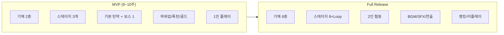
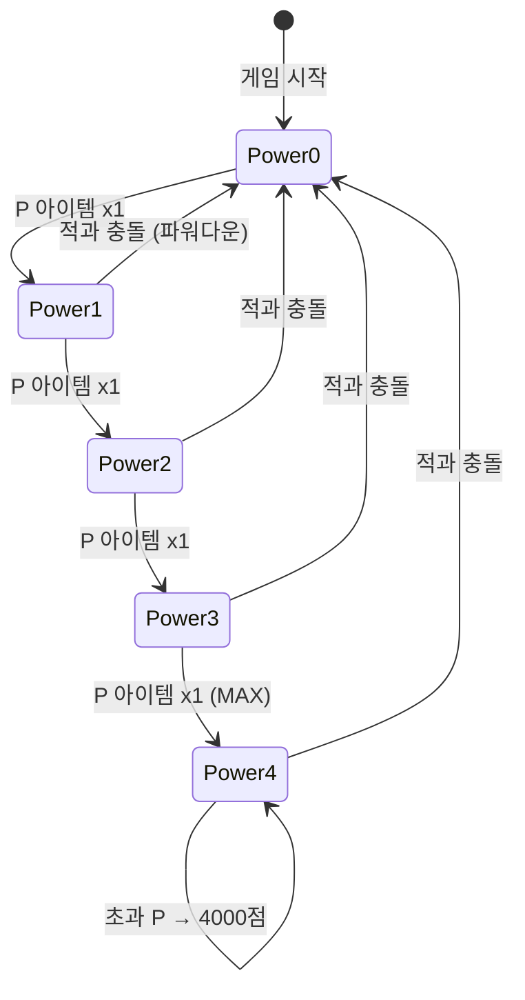
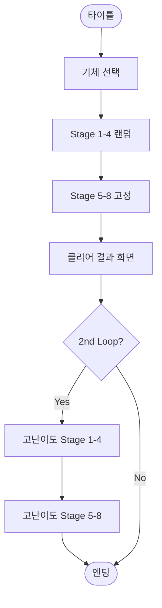
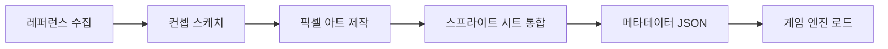
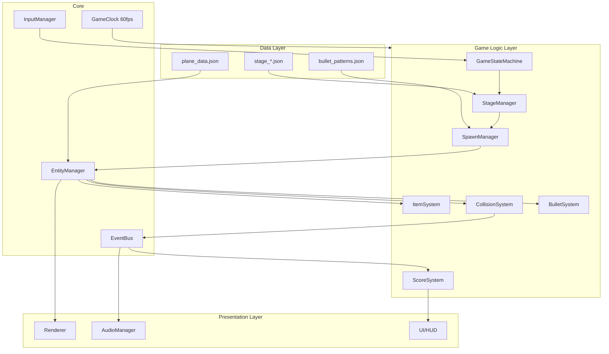
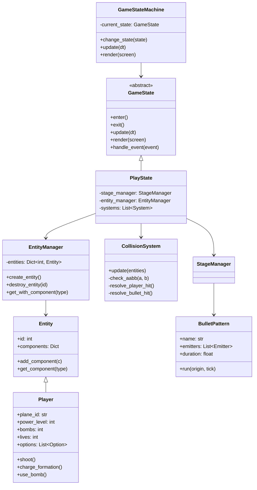
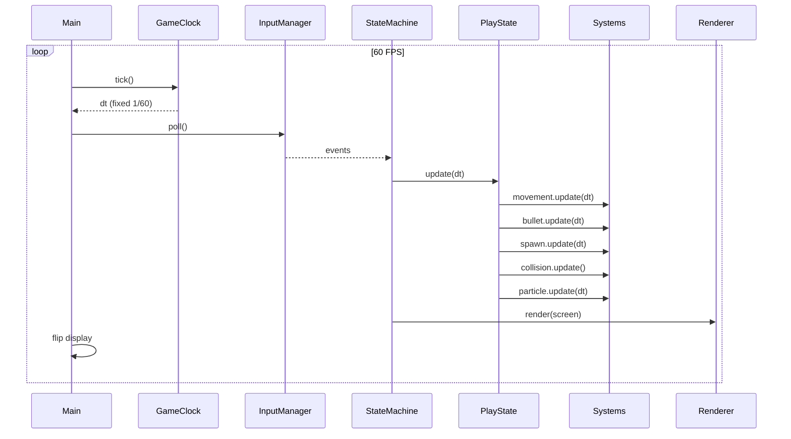
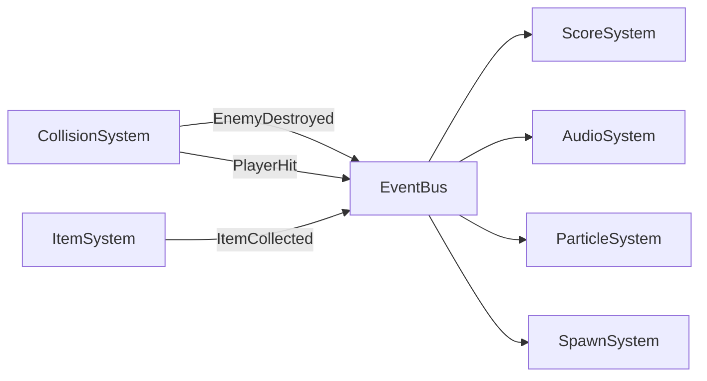
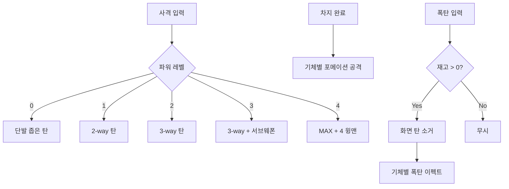
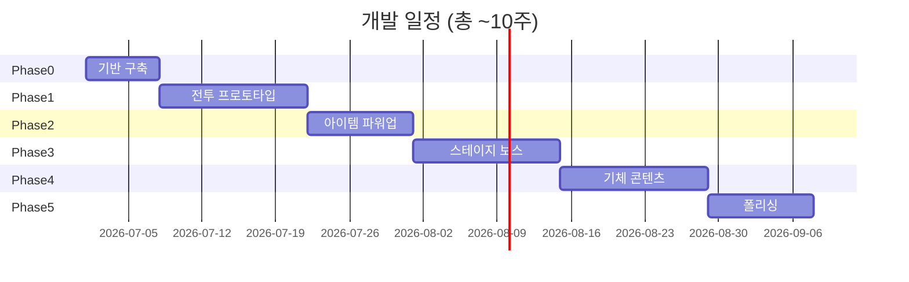

# 1945 스타일 슈팅 게임 — 개발계획서 & 아키텍처

> **프로젝트명:** Strikers 1945 Inspired Shooter
> **장르:** 세로 스크롤 슈팅 (Vertical Scrolling Shoot 'em up)
> **참고작:** Psikyo *Strikers 1945* (1995)
> **작성일:** 2026-06-29

> **GitHub Pages 통합:** 이 문서의 Python/Pygame 설계는 데스크톱 참고 구현이다. `smiler07.github.io`의 최종 Shooting 게임은 별도 백엔드 없이 JavaScript/HTML5 Canvas로 포팅하며, Games 선택기에서 Snake와 함께 제공한다.

## 0. GitHub Pages Web 포팅 트랙

### 0.1 목표와 경계

- Python/Pygame 원본의 핵심 재미와 검증된 규칙을 Web MVP로 옮긴다.
- Python 코드를 브라우저에서 직접 실행하거나 WebAssembly/Pyodide를 임의 도입하지 않는다.
- `venv`, `.pytest_cache`, `__pycache__`, `*.pyc`와 개발 전용 Python dependency는 배포하지 않는다.
- 원작 게임의 명칭·스프라이트·사운드를 무단 복제하지 않고 자체 도형·절차적 표현 또는 승인된 assets를 사용한다.

### 0.2 Web MVP

| 기능 | Web MVP | 확장 후보 |
|---|---|---|
| 플레이어 | 1기체 이동·피격·생명 | 기존 6기체 특성 |
| 공격 | 일반 사격 | 차지·포메이션·폭탄 |
| 적 | 기본 적과 deterministic spawn | 다중 적·보스·탄막 패턴 |
| 진행 | 단일 짧은 stage 또는 endless | 전체 스테이지·2nd Loop |
| UI | 점수, 생명, pause, game over, restart | power·bomb·high score |
| 입력 | 키보드와 모바일 이동·사격 | gamepad·고급 touch gesture |

Web MVP 범위와 확장 기능 우선순위는 `[사람 확인 필요]`다.

### 0.3 Python → Web 매핑

| Python/Pygame 참고 영역 | Web 포팅 대상 |
|---|---|
| `states/*` | JavaScript game state와 lifecycle controller |
| `entities/*` | 순수 JavaScript state object/class |
| `systems/*` | update 단계의 사격·충돌·효과 함수 |
| `render/*` | HTML5 Canvas renderer와 responsive scale |
| `core/input_manager.py` | keyboard/pointer/touch input adapter |
| `tests/test_game_logic.py` | 별도 Node 내장 JavaScript unit test 계약 |

### 0.4 통합 완료 기준

- Games 영역에서 Snake/Shooting을 키보드와 터치로 선택할 수 있다.
- 한 번에 한 게임만 실행하며 게임 전환 후 timer·RAF·listener가 남지 않는다.
- Shooting은 Python/Pygame/서버 없이 GitHub Pages에서 단독 실행된다.
- 375px, 768px, 1440px에서 Canvas와 control이 viewport를 넘지 않는다.
- 키보드 및 모바일에서 이동·사격·pause·restart가 작동한다.
- Web 포팅용 JavaScript 단위 테스트와 브라우저 상호작용 Verifier가 통과한다.

상세 실행 순서와 실패 분류는 저장소 루트의 `AORR.md`, 현재 상태와 가드레일은 `MEMORY.md`를 기준으로 한다.

---

## 1. 프로젝트 개요

### 1.1 목표

오락실에서 즐기던 **1945**의 핵심 재미를 현대적으로 재현한다.

| 핵심 요소 | 설명 |
|-----------|------|
| 기체 선택 | P-38, P-51, Spitfire 등 WWII 전투기, 기체별 고유 무기·폭탄·포메이션 |
| 총알 회피 | 탄막(Bullet Hell) 패턴, 작은 히트박스로 회피 플레이 |
| 파워업 | 적 격추 시 드롭되는 P 아이템으로 주무기 강화 + 윙맨(Option) 추가 |
| 폭탄 | B 아이템 수집, 위기 시 화면 탄막 소거 + 기체별 특수 폭탄 |
| 황금 | 건물·지상 목표 파괴 시 골드바 드롭 → 보너스 점수 |
| 스테이지 | 8스테이지(전반 4개 랜덤) + 2nd Loop 난이도 상승 |

### 1.2 범위 정의 (MVP vs Full)



### 1.3 비목표 (Out of Scope — 초기)

- 온라인 PvP, 가챠/과금 시스템
- 3D 그래픽 (2D 픽셀/스프라이트 기반 유지)
- 모바일 터치 전용 UI (PC 키보드·패드 우선, 이후 포팅)

---

## 2. 게임 디자인 상세

### 2.1 조작 체계

| 입력 | 동작 |
|------|------|
| 방향키 / 왼쪽 스틱 | 기체 이동 (8방향) |
| Z / A 버튼 (탭) | 일반 사격 |
| Z / A 버튼 (홀드→해제) | 포메이션 공격 (차지 후 윙맨 소환) |
| X / B 버튼 | 폭탄 사용 (재고 1개 소모) |
| Shift | 속도 저하 (정밀 회피, 옵션) |
| Enter | 일시정지 |

### 2.2 기체별 차별화 (Full 기준)

| 기체 | 특성 | 서브웨폰 | 포메이션 | 폭탄 |
|------|------|----------|----------|------|
| P-38 Lightning | 초보자용, 넓은 사격각 | 관통 로켓 | V자 드론 | 전방 에너지 블래스트 |
| P-51 Mustang | 균형형 | 유도 미사일 | 정지 회전 드론 | 스투카 급습 |
| Spitfire | 소형 히트박스 | 자동 추적탄 | 전방 고속 드론 | 화면 바람 (탄 소거) |
| Bf-109 | 중급 | 전방 폭탄 3발 | 적 추적 드론 | — |
| Zero | 고급, 느림 | 근거리 고화력 | 적 부착 드론 | 탄막 소거 바람 |
| Shinden | 최고속 | 고화력 로켓 | 상단 양측 사격 드론 | 실루엣 돌진 |

> MVP에서는 **P-38**, **Spitfire** 2종만 구현하고 나머지는 데이터 드리븐으로 확장.

### 2.3 파워업 시스템



- **P 아이템:** 빨간 적·특정 오브젝트 격추 시 드롭
- **레벨당 효과:** 주무기 탄 수/위력 증가 + 윙맨 1기 추가 (최대 4)
- **B 아이템:** 폭탄 재고 +1 (최대 6, 초과 시 10,000점)
- **골드바:** 200 / 500 / 1,000 / 2,000점 (지상 타겟 파괴)

### 2.4 스테이지 구조



각 스테이지 구성:
1. **스크롤 구간** — 지상/공중 적, 골드 타겟
2. **미드보스** (선택) — 중간 난이도 스파이크
3. **메인 보스** — 패턴 페이즈 2~4단, 격추 시 스테이지 클리어

### 2.5 점수·생명 시스템

- 초기 생명 3, 600,000점 달성 시 1UP
- 스테이지 클리어 시: 클리어 타임 + 골드 수 + 격추 수 → 은/금 메달
- 2nd Loop: 복수탄(Revenge Bullet) 활성화, Rank 최대

---

## 3. 비주얼 & 사운드 디자인 가이드

### 3.1 레퍼런스 (시각적 방향)

원작 Psikyo *Strikers 1945* 및 동시대 슈팅 게임에서 차용할 요소:

| 참고 소스 | 차용 요소 |
|-----------|-----------|
| **Strikers 1945** (Psikyo) | WWII 픽셀 스프라이트, 산업 배경, 빨간 적=P드롭, 골드바 이펙트 |
| **DoDonPachi** (Cave) | 탄막 가독성 — 탄 색상 대비, 플레이어 탄 vs 적 탄 구분 |
| **Raiden II** | 폭발 파티클, 보스 HP 게이지 UI |
| **1942 / 1943** (Capcom) | 롤링(무적 회피) — 옵션 기능으로 검토 |

**아트 스타일 권장:**
- 해상도: 내부 384×448 (원작 근사) → 2×~3× 스케일 출력
- 팔레트: 제한된 색 (16~64색), 따뜻한 WWII 톤 + 네온 탄막 대비
- 스프라이트: 32×32 ~ 64×64 기체, 8×8 ~ 16×16 탄
- 배경: 다층 패럴랙스 (하늘 3층 + 지상 스크롤)

### 3.2 UI 레이아웃

```
┌─────────────────────────────────┐
│  SCORE: 0000000    HI: 0000000  │  ← 상단 HUD
│  ★★★ (생명)          BOMBS: ●●●  │
├─────────────────────────────────┤
│                                 │
│         [ 게임 플레이 영역 ]       │  ← 384×448 논리 해상도
│              ✈                  │
│         · · · · ·               │
│                                 │
├─────────────────────────────────┤
│  POWER ████░░  (4단계)          │  ← 하단 파워 게이지
└─────────────────────────────────┘
```

### 3.3 사운드

- **BGM:** FM 신스풍 칩튠 (스테이지별 1곡, 보스 전용 BGM)
- **SFX:** 사격(기체별), 폭발, 아이템 획득, 차지 완료음, 폭탄, 보스 경고
- **라이브러리:** `pygame.mixer` 또는 Godot AudioStreamPlayer

### 3.4 에셋 파이프라인



- **도구:** Aseprite (픽셀), Tiled (맵), Audacity/BFXR (SFX)
- **라이선스 주의:** 상용 에셋은 CC0 또는 직접 제작. 원작 스프라이트 무단 사용 금지
- **무료 참고 에셋:** OpenGameArt.org `shmup`, `WWII aircraft` 태그

---

## 4. 기술 스택 선정

### 4.1 권장: Python + Pygame (로컬 PC)

| 항목 | 선택 | 이유 |
|------|------|------|
| 언어 | Python 3.11+ | 빠른 프로토타이핑, venv 격리 |
| 프레임워크 | Pygame CE 2.4+ | 2D 스프라이트·충돌·사운드 내장 |
| 데이터 | JSON / TOML | 스테이지·기체·적 패턴 외부화 |
| 빌드 | PyInstaller | 단일 exe 배포 (Windows) |

**대안:**

| 스택 | 장점 | 단점 |
|------|------|------|
| **Godot 4** | 씬 에디터, 파티클, 애니메이션 | GDScript 학습 필요 |
| **Phaser 3 + TypeScript** | 웹 배포 용이 | 브라우저 성능 한계 |
| **Unity 2D** | 에셋 스토어 풍부 | 오버킬, 빌드 무거움 |

> 본 계획서의 아키텍처는 **Pygame + ECS** 기준으로 작성. Godot 포팅 시 씬 트리로 1:1 매핑 가능.

### 4.2 개발 환경

```bash
# 가상환경 생성 (Windows)
python -m venv venv
venv\Scripts\activate
pip install pygame-ce numpy
```

---

## 5. 소프트웨어 아키텍처

### 5.1 아키텍처 개요

**패턴:** Entity-Component-System (ECS) + 상태 머신 (Game State Machine)



### 5.2 디렉터리 구조

```
shooting_game/
├── docs/
│   └── DEVELOPMENT_PLAN.md
├── assets/
│   ├── sprites/
│   │   ├── planes/
│   │   ├── enemies/
│   │   ├── bullets/
│   │   ├── items/
│   │   └── effects/
│   ├── audio/
│   │   ├── bgm/
│   │   └── sfx/
│   ├── fonts/
│   └── data/
│       ├── planes.json
│       ├── stages/
│       └── patterns/
├── src/
│   ├── main.py                 # 엔트리포인트
│   ├── core/
│   │   ├── entity.py           # Entity, Component 베이스
│   │   ├── event_bus.py
│   │   ├── game_clock.py
│   │   └── input_manager.py
│   ├── states/
│   │   ├── base_state.py
│   │   ├── title_state.py
│   │   ├── select_state.py
│   │   ├── play_state.py
│   │   └── result_state.py
│   ├── systems/
│   │   ├── movement_system.py
│   │   ├── bullet_system.py
│   │   ├── collision_system.py
│   │   ├── spawn_system.py
│   │   ├── item_system.py
│   │   ├── particle_system.py
│   │   └── audio_system.py
│   ├── entities/
│   │   ├── player.py
│   │   ├── enemy.py
│   │   ├── boss.py
│   │   ├── bullet.py
│   │   └── item.py
│   ├── patterns/
│   │   ├── bullet_pattern.py   # 탄막 패턴 DSL
│   │   └── pattern_runner.py
│   ├── render/
│   │   ├── renderer.py
│   │   ├── parallax.py
│   │   └── hud.py
│   └── config.py
├── tests/
│   ├── test_collision.py
│   ├── test_patterns.py
│   └── test_powerup.py
├── requirements.txt
├── README.md
└── venv/
```

### 5.3 클래스 다이어그램 (핵심)



### 5.4 게임 루프 시퀀스



### 5.5 이벤트 버스 (느슨한 결합)



주요 이벤트:
- `enemy_destroyed(enemy_id, position, drops)`
- `player_hit(damage_type)` — power_down / life_lost
- `item_collected(item_type, value)`
- `boss_phase_changed(phase)`
- `stage_cleared(stats)`

### 5.6 탄막 패턴 DSL (데이터 드리븐)

```json
{
  "name": "spiral_12",
  "duration": 3.0,
  "emitters": [
    {
      "type": "radial",
      "bullet": "enemy_small",
      "count": 12,
      "speed": 2.5,
      "angle_offset_increment": 15,
      "interval": 0.1
    }
  ]
}
```

패턴 타입: `radial`, `aimed`, `wave`, `random_spread`, `boss_phase`

### 5.7 충돌 검사 전략

| 대상 | 방식 | 비고 |
|------|------|------|
| 플레이어 탄 ↔ 적 | AABB + 그리드 공간 분할 | 적 다수 시 O(n) 최적화 |
| 적 탄 ↔ 플레이어 | 원형 히트박스 (작게) | 피격 판정 2~4px |
| 플레이어 ↔ 적기 | AABB | 충돌 시 파워다운 또는 생명 -1 |
| 플레이어 ↔ 아이템 | AABB (넓은 획득 범위) | 자석 효과 옵션 |

---

## 6. 핵심 시스템 상세

### 6.1 플레이어 무기 시스템



### 6.2 스폰 시스템

- 스테이지 JSON에 **타임라인 이벤트** 정의
- 이벤트 타입: `spawn_enemy`, `spawn_wave`, `scroll_speed`, `boss_warning`, `boss_spawn`

```json
{
  "stage_id": "stage_01",
  "duration": 120,
  "events": [
    { "time": 5.0, "type": "spawn_wave", "pattern": "formation_3", "enemy": "fighter_red" },
    { "time": 90.0, "type": "boss_warning" },
    { "time": 95.0, "type": "boss_spawn", "boss": "boss_tank" }
  ]
}
```

### 6.3 보스 시스템

- **Phase FSM:** HP 구간별 패턴 전환
- **약점 표시:** 코어 부위 별도 히트박스
- **격추 연출:** 폭발 시퀀스 → 아이템 대량 드롭 → 스테이지 종료

---

## 7. 개발 로드맵

### Phase 0 — 기반 구축 (1주)

- [ ] venv, pygame-ce, 프로젝트 스캐폴딩
- [ ] GameStateMachine, GameClock, InputManager
- [ ] 빈 PlayState에서 기체 이동 + 스크롤 배경

### Phase 1 — 전투 프로토타입 (2주)

- [ ] 플레이어 사격, 적 1종, 충돌 검사
- [ ] 적 탄막 패턴 2종 (직선, 부채꼴)
- [ ] 폭발 이펙트, 기본 HUD (점수, 생명)

### Phase 2 — 아이템 & 파워업 (1.5주)

- [ ] P / B / Gold 아이템 드롭·획득
- [ ] 파워 레벨 0~4, 윙맨 추적 이동
- [ ] 폭탄: 탄 소거 + 화면 플래시

### Phase 3 — 스테이지 & 보스 (2주)

- [ ] 타임라인 스폰 시스템
- [ ] 스테이지 3개 + 보스 1종 (2~3 페이즈)
- [ ] 패럴랙스 배경, 지상 골드 타겟

### Phase 4 — 기체 & 콘텐츠 확장 (2주)

- [ ] 기체 2종 완성 (데이터 드리븐 무기 차별)
- [ ] 포메이션 공격 (차지)
- [ ] 타이틀, 기체 선택, 결과 화면

### Phase 5 — 폴리싱 (1.5주)

- [ ] BGM/SFX, 화면 쉐이크, 보스 경고
- [ ] 난이도 밸런스, 2nd Loop 프로토
- [ ] PyInstaller 빌드, README



---

## 8. 품질 & 테스트 전략

### 8.1 테스트 피라미드

| 레벨 | 대상 | 도구 |
|------|------|------|
| Unit | 충돌 AABB, 파워업 로직, 패턴 파서 | pytest |
| Integration | 스폰 타임라인 + 적 격추 드롭 | pytest |
| Playtest | 탄막 난이도, 보스 패턴 | 수동 + 체크리스트 |

### 8.2 성능 목표

- **60 FPS** 고정 (논리 업데이트 `dt = 1/60`)
- 동시 탄 수 ~500발 유지
- 메모리: 스프라이트 풀링으로 GC 스파이크 방지

### 8.3 플레이테스트 체크리스트

- [ ] 파워 4에서 충돌 시 0으로 리셋되는가
- [ ] 폭탄 사용 중 무적 프레임이 있는가
- [ ] 보스 페이즈 전환 시 탄막이 겹치지 않는가
- [ ] 골드 점수가 정확히 합산되는가

---

## 9. 리스크 & 대응

| 리스크 | 영향 | 대응 |
|--------|------|------|
| 탄막 가독성 부족 | 높음 | 탄 색상 규칙, 반투명도, 플레이어 탄 우선 렌더 |
| 에셋 제작 지연 | 중간 | placeholder 도형 → 점진적 아트 교체 |
| 난이도 불균형 | 중간 | Rank 시스템, 초반 스테이지 데이터 튜닝 |
| Pygame 성능 한계 | 낮음 | 탄 오브젝트 풀링, 화면 밖 엔티티 비활성화 |

---

## 10. 다음 단계 (즉시 실행)

1. **기술 스택 확정** — Pygame vs Godot 최종 선택
2. **Phase 0 스캐폴딩** — `src/` 구조 및 `main.py` 부트스트랩
3. **플레이스홀더 에셋** — OpenGameArt에서 CC0 슈팅 스프라이트 1세트
4. **P-38 프로토타입** — 이동 + 사격 + 적 1종까지 1주 내 목표

---

## 부록 A — 용어집

| 용어 | 설명 |
|------|------|
| Option / 윙맨 | 파워업 시 따라다니며 보조 사격하는 드론 |
| Formation Attack | 차지 후 발동하는 기체별 특수 공격 |
| Rank | 플레이 숙련도에 따라 자동 상승하는 난이도 계수 |
| Revenge Bullet | 2nd Loop에서 적 격추 시 흩뿌려지는 복수탄 |
| Bullet Hell | 대량의 탄막을 회피하는 서브장르 |

## 부록 B — 참고 링크

- [Strikers 1945 — Shmups Wiki](http://shmups.wiki/library/Strikers_1945)
- [OpenGameArt — Shmup Assets](https://opengameart.org/art-search-advanced?keys=shmup)
- [Pygame CE Documentation](https://pyga.me/docs/)
- [Bullet Pattern Design (GitHub Gist examples)](https://github.com/search?q=bullet+hell+pattern)
